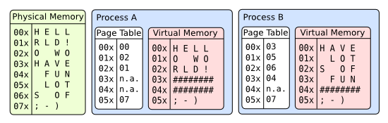

=== Overview

Rust is a modern systems programming language that achieves an uncommon combination of memory safety and bare-metal performance.
Its lack of a garbage collector, paired with powerful zero-cost abstractions, makes it a natural fit for writing correct, efficient kernel and bootloader code.

This paper describes *Telos*, a custom UEFI bootloader for an x86-64 kernel.
The bootloader is responsible for preparing a well-defined execution environment and transferring control through a custom boot protocol.
The kernel is kept as a minimal entry stub so that the loader and its interaction with the firmware remain the focus.

=== Motivation

Kernel development sits at the very foundation of software: the point where code meets hardware directly.
It has long been a personal passion of mine, and Rust's ownership model makes it an especially compelling tool for this task.

Having written several kernel projects over the years, and having made no shortage of mistakes along the way, I wanted to produce a comprehensive, streamlined resource for anyone looking to start their own OS project.
https://github.com/nereusfoundation/nereus-os[Nereus OS], the most recent of those projects, underpins much of the practical knowledge presented here.

=== State at Loader Entry

The Unified Extensible Firmware Interface (UEFI) defines the environment between platform firmware and an operating-system loader.
For removable x86-64 media, the firmware can load the PE32+ application at `\EFI\BOOT\BOOTX64.EFI` from the EFI System Partition and call its entry point.
Devices and firmware functions are exposed through handles and protocols.

Unlike a legacy BIOS bootloader, an x86-64 UEFI application does not begin in 16-bit real mode.
The firmware has already initialized the platform, entered x86-64 long mode, and enabled paging with an identity-mapped address space.
The Rust loader can therefore begin as ordinary 64-bit code without an A20, protected-mode, or long-mode transition.
The existing mappings also mean that pointers returned by UEFI are immediately usable, but they remain part of a firmware-controlled environment.

In the general case, paging allows each virtual address space to arrange physical pages differently.
The page tables in the following figure make the same physical memory appear in different orders to processes A and B; they may also leave pages unmapped.

.Virtual address spaces mapped through page tables

At UEFI entry the relevant mapping is simpler: an _identity mapping_ maps each virtual address to the numerically identical physical address.
The two halves of the following table therefore describe the same underlying bytes, not two copies of them.
Reading virtual address `01x`, for example, accesses physical address `01x`.

.Identity-mapped physical and virtual memory
[%unbreakable,cols="2,1,1,1,1,2,1,1,1,1",options="header",width="100%"]
|===
5+^|Physical Memory
5+^|Loader Virtual Memory

|Address |0 |1 |2 |3
|Address |0 |1 |2 |3

|`00x` |H |E |L |L
|`00x` |H |E |L |L

|`01x` |O |  |W |O
|`01x` |O |  |W |O

|`02x` |R |L |D |!
|`02x` |R |L |D |!

|`03x` |; |- |) |
|`03x` |; |- |) |
|===

UEFI boot services—including protocol discovery, file access, and page allocation—remain available until `ExitBootServices` succeeds.
Any replacement page tables must preserve access to the loader's active code, stack, data, and required firmware buffers until that transition is complete.
The OSDev Wiki provides more detail in its https://wiki.osdev.org/EFI[UEFI chapter] and https://wiki.osdev.org/Setting_Up_Long_Mode[Setting Up Long Mode] chapter.
